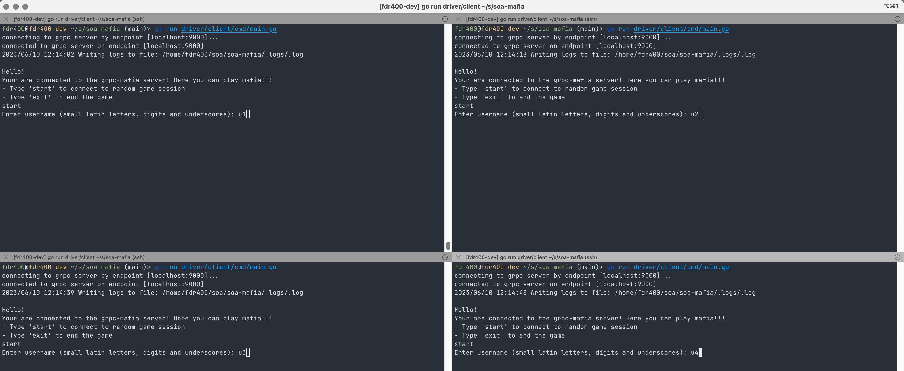
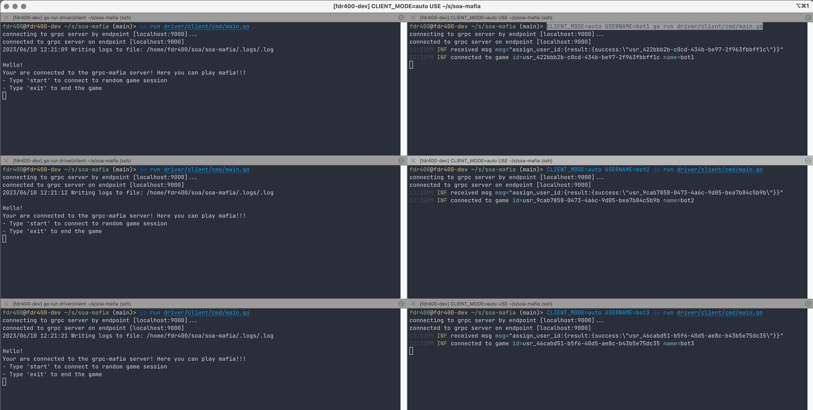
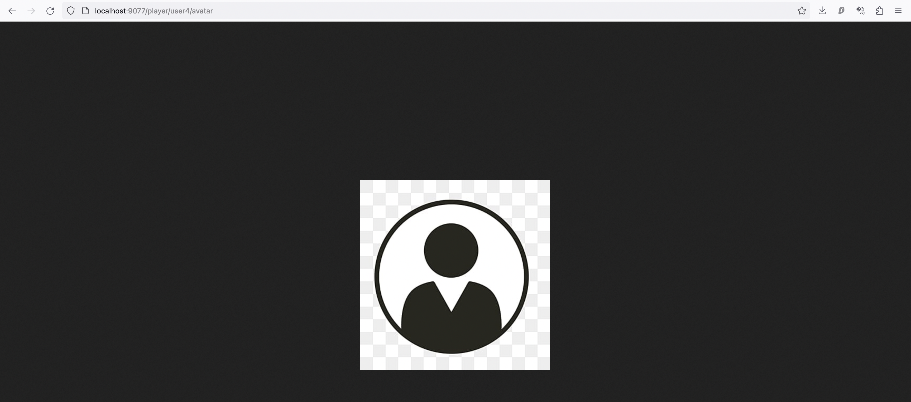

# soa-mafia

Реализация игры мафия в виде чат-интерфейса командной строки

### Установка
Скачать репозиторий и перейти в него:
```bash
$ git clone git@github.com:fdr896/soa-mafia.git
$ cd soa-mafia/
```

### Требования к программному обеспечению
Для комфортной работе на хосте должны быть установлены `docker` и `go` версии не меньше `1.19` (всё тестирование проводилось с версией `1.19`)

### Ручная сборка докер образов сервера и клиента
Не потребуется при работе через `docker compose`

Для сборки докер-образов написан специальный скрипт, которые собирает образы и выкладывает их на docker-hub. Для его запуска необходимо выполнить:
```bash
$ chmod +x deploy_production.sh
$ ./deploy_production.sh
```

## Домашнее задание 2
Реализация и описание интерфейса располагается в [soa-mafia/driver](https://github.com/fdr896/soa-mafia/tree/main/driver)

Взаимодействие с клиентом происходит через чат-интерфейс в командной строке.

Правила использования показываются при запуске:
```
Voting:
    - 'vote' (enter voting mode to vote for mafia)
Chat:
    - 'read' (start reading current day chat)
    - 'read_all' (read all chat history)
    - 'read_last_n' (read last 'n' messages)
    - 'write' (write to game session chat)
Game Information:
    - 'role' (your role)
    - 'state' (game state)
    - 'nicks' (alive players' nicknames)
Interfaction With The Interface:
    - 'exit' (interrupt the game)
    - 'rules' (rules again)
```
В данном домашнем задании раздел `Chat` не используется

При успешном запуске клиента в консоли должно появится сообщение следующего вида:
```
connecting to grpc server by endpoint [localhost:9000]...
connected to grpc server on endpoint [localhost:9000]
2023/06/07 22:08:27 Writing logs to file: /home/fdr400/soa/soa-mafia/.logs/fdr400.log

Hello, fdr400!
Your are connected to the grpc-mafia server! Here you can play mafia!!!
- Type 'start' to connect to random game session
- Type 'exit' to end the game
```
Нужно ввести `start`, потом в появившемся интерфейсе ввести своё ник, и после ожидания всех игроков, клиент подключится к одной из игровых сессий

После начала игры в консоли нужно вводить команды из списка выше. По ходу игры должно быть понятно, что происходит на данный момент

По завершению игры клиент отключается и завершает процесс. Для подключения к новой игре нужно запустить клиента заново

### Запуск игры с ботами
Чтобы запустить сервер и трёх клиентов-ботов, необходимо выполнить
```bash
$ docker compose up
```
Для запуска клиента нужно в отдельном терминале запустить
```bash
$ go run driver/client/cmd/main.go
```
После чего начнётся игра на 4-ёх игроков, один из которых будет мафией, а один комиссаром.

Далее необходимо проследовать инструкции, которая будет выведена в терминале

После окончания игры, процесс клиента завершится, но процессы ботов перезапустятся.
Таким образом, для начала новой игры с ботами можно просто заново запустить клиент

### Запуск игры без ботов
Чтобы запустить сервер, необходимо выполнить (брокер нужен для обратной совместимости со следующими домашники заданиями)
```bash
$ docker compose up rabbitmq server
```
Будет автоматически создан сервер, которые ожидает 4-ёх игроков на одну сессию

Далее необходимо запустить 4-ёх клиентов с разными именами

Пример:


### Запуск игры с заданным числом игроков и мафий
Чтобы запустить сервер, который ожидает заданного числа игроков и мафий, необходимо выполнить
```bash
$ docker compose up rabbitmq -d
$ docker compose run -e SESSION_PLAYERS=6 -e MAFIAS=2 -e PORT=9000 -p 9000:9000/tcp server
```

Мафий должно быть меньше, чем половина всех игроков (иначе мафия победит в первый же день)

Далее нужно запустить указанное число клиентов, каждый из которых может быть как ботом, так и настоящим клиентом.

Пример запуска с 3-мя ботами и 3-мя обычными клиентами (для ботов необходимо явно выставить переменные окружения `USERNAME` и `CLIENT_MODE=auto`; боты сами подключатся к игре):


### Запуск нескольких сессий игры
Клиенты автоматически подключаются к первой неполной сессии игры, которые сервис создаёт при наполнении предыдущих сессий

## Домашние задание 3
Реализация и описание интерфейса располагается в [soa-mafia/chat](https://github.com/fdr896/soa-mafia/tree/main/chat). Использование интерфейса чата реализовано в [soa-mafia/driver](https://github.com/fdr896/soa-mafia/tree/main/driver)

В клиент добавляется раздел команд для взаимодействия с дневным чатом чатом:
```bash
Chat:
    - 'read' (start reading current day chat)
    - 'read_all' (read all chat history)
    - 'read_last_n' (read last 'n' messages)
    - 'write' (write to game session chat)
```
- `read`: клиент начинает слушать сообщения от всех игроков в его сессии за данный день игры. При запуске этой команды каждый раз выводятся все сообщения за день. Пример: 
- 'read_all': вывод всех сообщений за все дни в рамках игровой сессии
- 'read_last_n': вывод последних `n` сообщений за всю историю игрового чата в рамках данной сессии. Пример: 
- 'write': написать одно сообщение в чат, которое получат все участники игры (кроме духов). Пример: 

Также для мафий добавляется интерфейс для взаимодействия друг с другом в ночном чате (который могут читать только они):
```bash
[[Chat Commands]]:
    - 'read' (start reading chat)
    - 'write' (write to chat)
    - 'kill' (choose player that you want to kill)
```
Пример (мафии могут общаться между собой, а остальные игроки этого не видят; мафии в правых нижних чатах):


### Запуск
Запуск полностью аналогичен запуску сервиса в предыдущем домашнем задании

## Домашние задание 4
Реализация и описание интерфейса располагается в [soa-mafia/stat_manager](https://github.com/fdr896/soa-mafia/tree/main/stat_manager).

Сервис представляет из HTTP REST API сервер, который может работать как отдельно от остальных компонент, так и вместе сними, собирая статистику о игроках.

**Важно:** чтобы статистика по игроку собиралась, нужно сначала создать его в этом сервисе с таким же именем (для незарегистрированных игроков статистика не собирается)

### Запуск
Для запуска только данного сервиса, можно выполнить
```bash
$ docker compose up stat_manager
```
Для запуска всего сервиса, необходимо выполнить
```bash
$ docker compose up
```
Сервер поднимется на `9077` порту

### Интерфейс
Сервис предоставляет следующий интерфейс для работы с внешними клиентами:
```
GET    /ping
GET    /player/:username
GET    /player
GET    /player/:username/avatar
GET    /player/:username/pdf
POST   /player
POST   /player/:username/pdf
PUT    /player/:username
DELETE /player/:username
```

### Работа
Работу сервиса можно протестировать с помощью консольной утилиты `curl`

- `GET /player/:username` (возвращает информацию о пользователе)
Пример запроса:
```bash
$ curl http://localhost:9077/player/user
```
Пример ответа:
```json
{"username":"user","email":"email@email.email","gender":"male"}
```

- `GET /player` (возвращает информацию о нескольких пользователях, именя передаются в парметре запроса `usernames` через запятую)
Пример запроса:
```bash
$ curl http://localhost:9077/player?usernames=user1,user2
```
Пример ответа:
```json
{"players":[{"username":"user1","email":"email@email.email","gender":"male"},{"username":"user2","email":"email@email.email","gender":"male"}]}
```

- `GET /player/:username/avatar` (возвращает аватар пользователя)
Пример запроса:
```bash
$ curl http://localhost:9077/player/user/avatar
```
Пример ответа:


- `GET /player/:username/pdf` (возвращает сгенерированный pdf-файл со статистикой игрока)
Пример запроса:
```bash
$ curl http://localhost:9077/player/user/pdf
```
Пример ответа:


- `POST /player` (создаёт пользователя)
Пример запроса без задания аватара (в данном случае, аватар назначится дефолтным ([default_avatar.png](https://github.com/fdr896/soa-mafia/tree/main/stat_manager/storage/filesystem/data/default_avatar.png))):
```bash
$ curl -X POST http://localhost:9077/player \
  -F "username=user" \
  -F "email=email@email.email" \
  -F "gender=male" \
  -H "Content-Type: multipart/form-data"
```
Пример запроса с заданным аватаром (нужно указать относительный путь до файла с аватаром):
```bash
$ curl -X POST http://localhost:9077/player \
  -F "username=user_with_avatar" \
  -F "email=avatars_email@email.email" \
  -F "gender=male" \
  -F "avatar=@avatar.jpeg" \
  -H "Content-Type: multipart/form-data"
```

- `POST /player/:username/pdf` (посылает задачу генерации pdf-файла со статистикой в менеджер задач и моментально возвращет URL, по которому будет доступен сгенерированный файл)
Пример запроса:
```bash
$ curl -X POST http://localhost:9077/player/user/pdf
```
Пример ответа:
```
http://localhost:9077/player/user/pdf
```

- `PUT /player/:username` (обновляет преданную информацию о пользователе; можно задавать не все поля):
```bash
$ curl -X PUT http://localhost:9077/player/user \
  -F "email=a@b.c" \
  -F "avatar=@avatar.png" \
  -H "Content-Type: multipart/form-data"
```

- `DELETE /player/:username` (удаляет пользователя):
```bash
$ curl -X DELETE http://localhost:9077/player/user
```

Примеры запросов также можно посмотреть в [stat_manager/queries](https://github.com/fdr896/soa-mafia/tree/main/stat_manager/queries)

### Валидация запросов
Параметры запросов на создание пользователя и изменение пользовательской информации валидируются, поэтому `email` должен быть корректным email'ом, а `gender` должен быть равен либо `male`, либо `female`

### Аватары
Примеры аватаров лежат в [stat_manager/queries](https://github.com/fdr896/soa-mafia/tree/main/stat_manager/queries)
